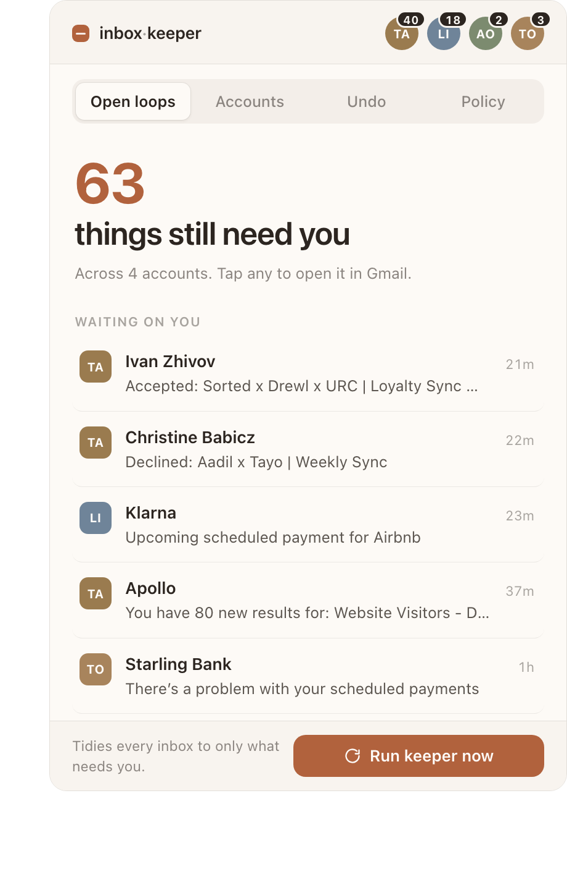
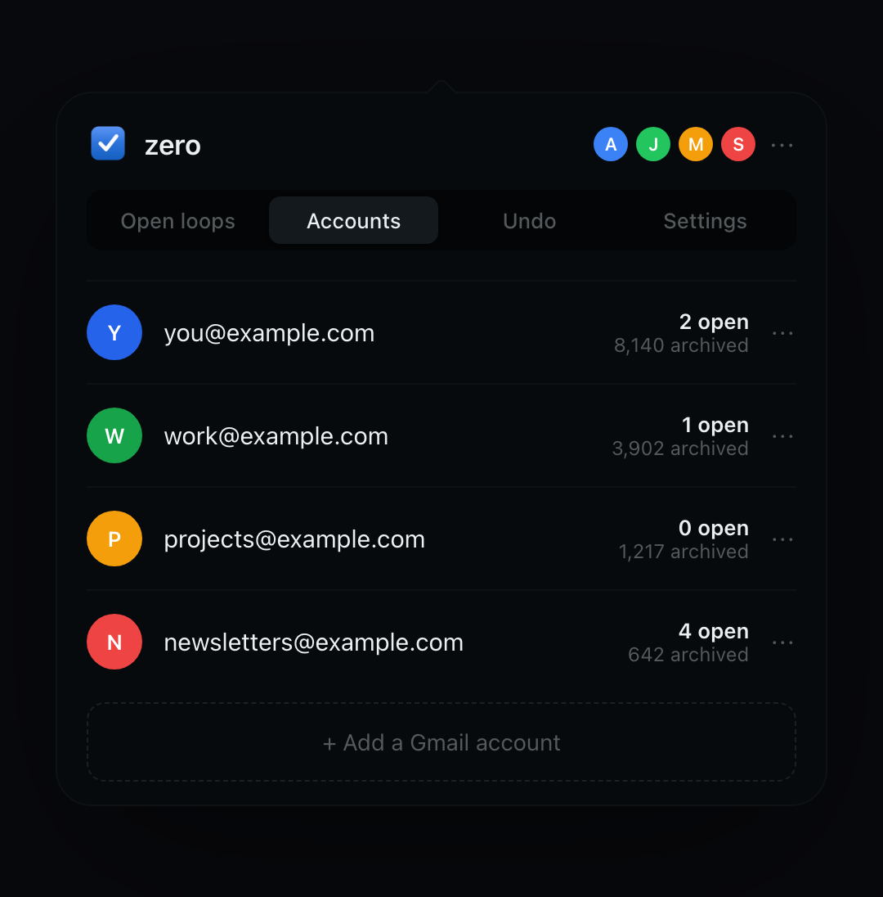
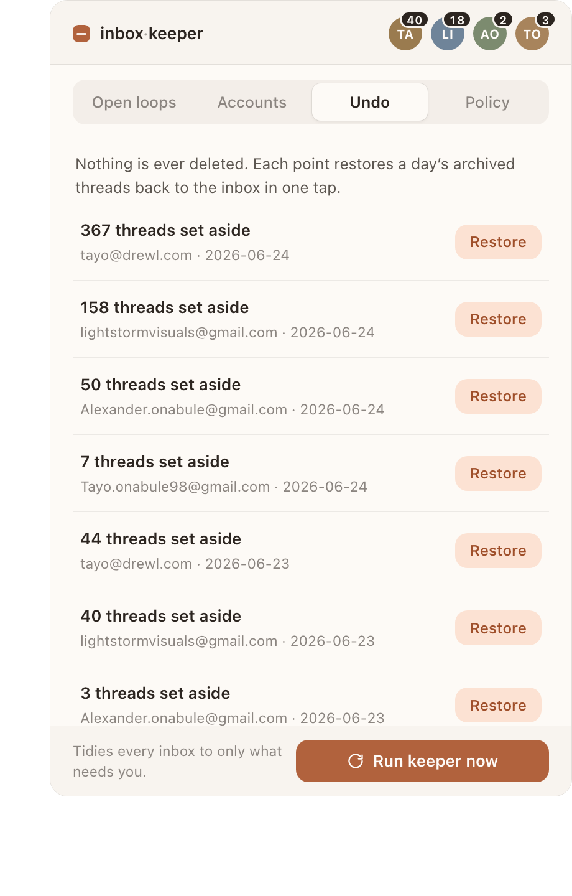
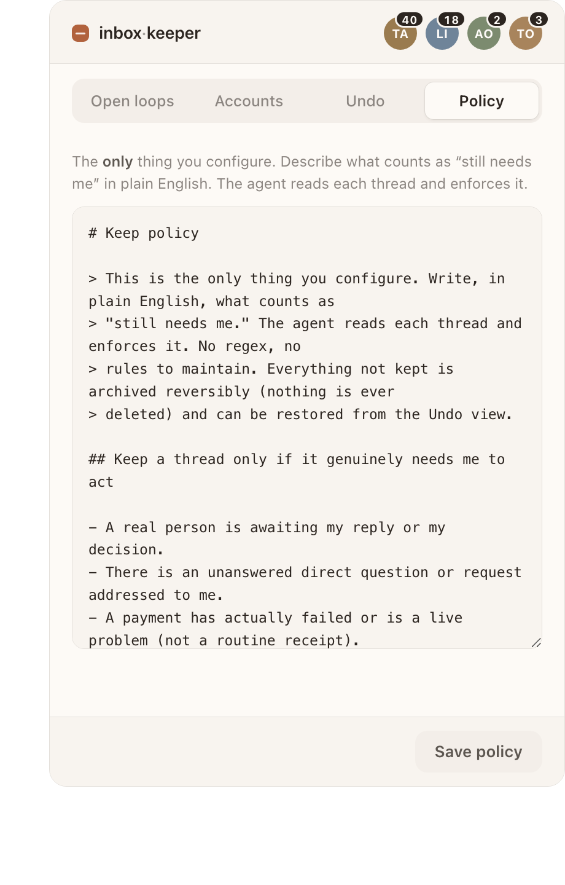

<div align="center">

# inbox-keeper

**Keep your inbox at "only what still needs you," across every account, and never lose anything.**

A quiet macOS menu-bar app that reads each thread, sets aside everything that
isn't waiting on you, and keeps the rest one tap away. Nothing is ever deleted.



</div>

---

## What it is

Most "inbox zero" tools make you do the sorting. This does the one part you'd
never finish by hand: continuously deciding what in your inbox is still an
**open loop** (something genuinely awaiting your action) and quietly setting
everything else aside.

It lives in the menu bar. You glance at it between meetings and see, across all
your accounts, the few things that actually need you. Everything else has been
archived reversibly, so the inbox stops being a swamp without anything going
missing.

Think of it as the inbox you'd keep if you had an hour every morning and perfect
memory of who is still waiting on you.

## Why you can trust it with your email

Three properties, in priority order:

1. **Reversible by construction.** "Archive" means remove the inbox label and add
   a dated recovery label. Mail stays in All Mail, fully searchable, and any day's
   sweep restores in one tap from the **Undo** view. Nothing is ever deleted.
2. **Ambient.** No new app to live in. Your Gmail and Apple Mail stay exactly as
   they are. This works quietly behind them, once a morning.
3. **The judgment is an agent, not a rule list.** What counts as "needs you" is
   described in plain English (see [keep-policy.md](keep-policy.md)) and enforced
   by a model that reads each thread. Cold outreach using a real person's name
   gets archived; a real person actually awaiting your reply is kept. A filter
   rule cannot tell those two apart.

## The panel

| Open loops | Accounts | Undo | Policy |
|:---:|:---:|:---:|:---:|
|  |  |  |  |
| What still needs you, across all accounts | Per-account inbox and archive counts | Restore any day's archived mail in one tap | The one thing you configure, in plain English |

## Install

Requires macOS, Python 3, and the [`gws` CLI](https://github.com/googleworkspace/cli)
(`npm i -g @googleworkspace/cli`) authenticated for each Gmail account. Swift (from
the Xcode command line tools) is needed only to build the menu-bar app.

```bash
git clone https://github.com/drewling/mail-triage.git inbox-keeper
cd inbox-keeper
./install.sh          # checks deps, sets up accounts.json, builds the app
```

Then edit `accounts.json` with your accounts (one entry per Gmail account):

```json
[
  { "slug": "primary", "email": "you@example.com",      "config_dir": "/Users/you/.config/gws" },
  { "slug": "work",    "email": "you.work@gmail.com",   "config_dir": "/Users/you/.config/gws/accounts/work" }
]
```

`config_dir` is the `gws` config directory for that account. Authenticate each
with `gws auth login` (see the `gws` docs for multi-account setup).

## Use it

```bash
./bin/inbox-keeper app         # launch the menu-bar app
./bin/inbox-keeper dashboard   # or open the panel in your browser
./bin/inbox-keeper run         # run the keeper now across all accounts
./bin/inbox-keeper schedule    # run it automatically every morning (07:00)
./bin/inbox-keeper unschedule  # remove the daily schedule
./bin/inbox-keeper state       # refresh the panel data
./bin/inbox-keeper stop        # stop the local panel server
```

Replies are drafted in your voice. To give the drafter more background (who you
are, how you write), drop a `knowledge/profile.md` (or `knowledge/<account-slug>.md`)
in the repo; it's optional and read only when present.

Click the menu-bar icon to open the panel. Hit **Run keeper now** to tidy every
inbox to only what needs you. Click any loop to open it in Gmail, or hover it to
**Reply** (drafts in your voice; review, edit, and send in the panel) or **set it
aside** (archived reversibly). Made a mistake? **Undo** restores a whole day's
archived mail. Add more inboxes from the **Accounts** tab.

As you set loops aside and edit drafts, the keeper learns your preferences and
applies them; you can see what it learned in the **Policy** tab.

To run it automatically every morning, point a `launchd` job at
`./bin/inbox-keeper run`. (`run.sh` is the older, fuller pipeline this grew out of,
including the legacy label-triage and Slack steps; `bin/inbox-keeper run` is the
clean keeper-only daily job and the one to schedule.)

## How "needs you" is decided

You edit one plain-language file, [keep-policy.md](keep-policy.md), or the
**Policy** tab in the panel. No regex, no config DSL. The default keeps a thread
only if a real person is awaiting your reply, there's an unanswered request to
you, a live payment problem, a legal matter, or a real deadline. Two signals do
most of the work:

- **Last message from you** means you already responded. It gets archived.
- **Never replied to this sender** plus cold/sales content means it was never a
  real loop, even with a person's name on it. It gets archived.

Everything archived is reversible. When unsure, the policy keeps it.

## How it works

```
menu-bar app (Swift)  ->  local panel (HTML/CSS/JS, no deps)
                              |  reads
                          app/state.json  <-  dashboard_state.py  (per-account status,
                              ^                                     open loops, undo points)
                              |  Run / Undo
                          keeper_server.py  ->  review_open_loops.py  (the agent keep-bar)
                                                gws CLI  ->  Gmail (reversible label swaps)
```

The Swift shell is deliberately thin: it starts the local server and shows the
web panel. All judgment runs through the Python the rest of the repo already
uses, with Gmail reached via the `gws` CLI. The panel never talks to Gmail
directly; it reads a cached state file so it opens instantly.

## Privacy and safety

- Everything runs locally on your Mac. No server, no third party sees your mail.
- The panel binds to `127.0.0.1` only.
- Nothing is ever deleted. Archiving is a reversible label change.
- `accounts.json` and the learning store stay out of git (see `.gitignore`).

## Beyond the keeper

This repo also contains the fuller morning pipeline it grew out of: AI-drafted
replies reviewed from Slack, a missed-items catch-up sweep, and a combined daily
digest. Those are optional and documented in [docs/PIPELINE.md](docs/PIPELINE.md)
and `TRIAGE.md`. The keeper and its panel are the core; the rest is the engine
room.

## License

[MIT](LICENSE)
