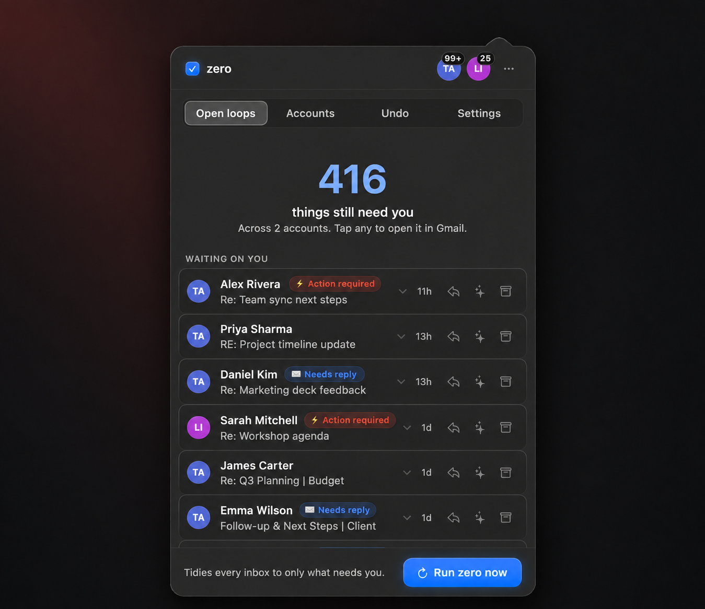

<div align="center">

# zero

**A Mac menu-bar app that keeps Gmail conversations you need to act on and archives the rest.**



[](https://zero.headless.com)
[](https://github.com/drewling/zero/releases)
[](LICENSE)

</div>

## What zero does

zero checks your connected Gmail inboxes for mail that needs your attention. It keeps those conversations in the Inbox and archives the rest. Archived mail stays in Gmail and can be restored.

Open zero from the menu bar to see that list, called **Open loops**. It includes replies people are waiting for and other things that need action, such as a failed payment. Click a conversation to open it in Gmail, set it aside, or ask for a reply draft. Replies are sent only when you click **Send reply**.

It runs on the schedule you choose, or you can run it by hand.

## Before you install

- A Mac with Apple Silicon running macOS 26 Tahoe or later.
- A Gmail account you can authorize with Google.
- A [TypeSafe Jev API key](https://console.typesafe.ai/keys). Jev is the AI service zero uses to sort mail.

The installer sets up Python 3, Node and the Google Workspace CLI (`gws`) if needed. It also installs Claude Code if it finds no supported agent CLI. Current onboarding still checks for Claude Code even if you do not use drafts. If it reports Claude missing, follow the command shown in the app.

The app is ad-hoc signed, **not Apple-notarized**, and it is not in the App Store. You can [read the installer](macapp/install-zero.sh) before running it. It downloads the release DMG and verifies its SHA-256 checksum before installing.

## Install

```bash
curl -fsSL https://zero.headless.com/install | bash
```

The installer puts `zero.app` in `/Applications` when possible, otherwise `~/Applications`, then opens it. It stops on an unsupported Mac and reports any missing prerequisites.

You can also download a release from the [Releases page](https://github.com/drewling/zero/releases). A browser-downloaded copy may trigger Gatekeeper because the app is not notarized. Follow macOS's **Privacy & Security → Open Anyway** guidance if needed.

## First run

1. **Connect Gmail.** Open zero from the menu bar and choose **Connect your first inbox**. The official download includes Google sign-in. You do not need to create a Google Cloud project. Google may show an unverified-app warning. zero has not completed Google's app verification. Read the prompt, then use **Advanced → Go to zero** only if you're comfortable granting access to your own mailbox. The app never sees your Google password.

   A source build without the bundled client can ask you for a `client_secret.json`. Use [docs/SETUP.md](docs/SETUP.md) for the complete Google Cloud and advanced setup instructions.

2. **Add your Jev key.** In **Settings → Sorting engine**, choose **Get a key** to open TypeSafe. Create a key, paste it into zero, and click **Save**. zero verifies it and stores it locally with owner-only permissions. Jev receives thread text to decide whether a thread should stay in the Inbox, and it's required even if you never touch drafting.

3. Reply drafts are optional. To use them, configure your chosen provider under **Settings → AI engine** and complete any login it requires. You review and edit the result in zero, then explicitly click **Send reply**.

4. Choose **Run zero now** for a first sweep, then set its days and time in **Settings → Daily schedule** once you like the result.

## Safety and data

- **Nothing is deleted.** Archiving removes Gmail's `INBOX` label and adds a dated undo label. The mail stays in All Mail and searchable. Restore a day's changes from zero's **Undo** view.
- The model can be wrong. Review your first few runs and adjust **Settings → Rules** if needed.
- The zero project does not operate a server that receives your email. The app connects to Google from your Mac. Classification sends relevant thread text to TypeSafe's Jev under your key. Reply drafts go to whichever agent provider you selected. Read the [privacy policy](https://zero.headless.com/privacy.html) and your providers' terms.
- zero itself is free. Jev usage is billed and rate-limited under your TypeSafe account. Optional drafts use the account behind your chosen agent CLI. Check those providers' prices and limits before scheduling unattended runs.
- Revoke Google access from [Google account permissions](https://myaccount.google.com/permissions). Removing an account in zero or deleting local app data does not revoke the Google grant.

## Contribute

The project is [AGPL-3.0-or-later](LICENSE). Start with [CONTRIBUTING.md](CONTRIBUTING.md), then see [setup instructions](docs/SETUP.md), the [architecture](docs/ARCHITECTURE.md), [API reference](docs/api/), [security policy](SECURITY.md), and [open issues](https://github.com/drewling/zero/issues).
