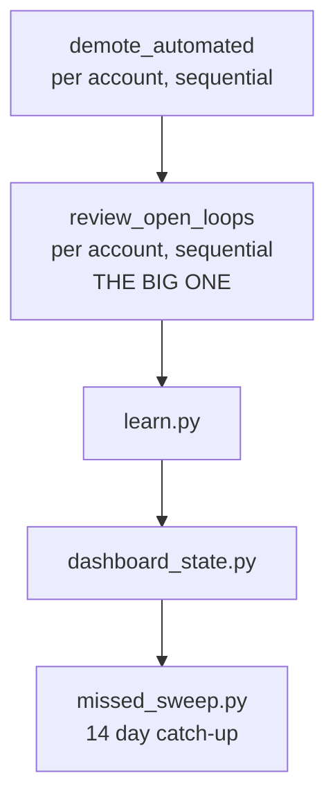

# Speed plan

How to make a zero run faster, in order of payoff. Written from measurements on
this machine and this codebase, not from guesses.

## The one thing to understand first

**Gmail's rate limit is the speed limit, not your Mac and not the network.**

Google allows 6,000 "quota units" per minute per account. We spend 80% of that
(4,800/min) to leave headroom. Every kind of call has a fixed price:

| Call | Price | What it gets you |
|---|---:|---|
| `threads.list` | 10 units per 100 threads | the list of thread IDs |
| `messages.list` | 5 units per 500 IDs | IDs in bulk |
| `messages.get` | 20 units | one message's headers |
| `threads.get` | 40 units | one thread's headers |

So for a 1,557-thread inbox:

- Reading every thread the old way (`threads.get`): 62,280 units = **13 minutes
  of pure waiting**, no matter how fast your Mac is.
- The current way (`messages.get` on just the newest message): 31,140 units =
  **6.5 minutes**.

By comparison the actual per-call overhead is tiny: I measured `gws` at 420ms
warm per call, of which only ~70ms is the Node.js startup. Across 1,557 calls at
16 workers that's 41 seconds total, and just 7 seconds of it is CLI startup.

**Conclusion: quota is the binding constraint by a factor of ten.** Any plan
that speeds up the plumbing (batch HTTP, a persistent daemon, more workers)
while still asking for the same data will move a 6.5 minute run to 6.4 minutes.
The only fixes that matter are the ones that **ask for less data**.

That reframes everything below. Speed work here is not "make calls faster", it
is "stop making calls".

## Where a run's time actually goes

The pipeline, in order, as `run.sh` executes it:

Last comparable full log (`run-20260624-070005.log`) came in at **4m 19s** total,
with the open-loop sweep at 1m 21s of it. That was on a smaller candidate set
(34 threads for the main account). On a full 1,557-thread inbox the open-loop
stage dominates completely.

Inside the open-loop stage, per thread:

1. **Download** the newest message's From/Subject (20 units, ~420ms, 16 in parallel).
2. **Check** whether you've ever written to this sender (grouped probe, 5 units per batch).
3. **Classify** with Jev: one HTTPS POST, 12 in parallel, ~5.5KB of prompt.
4. **Archive** the losers in one `batchModify` (50 units per 1,000 messages, already optimal).

## Ranked fixes

### 1. Make the cache actually work (biggest win, already 90% built)

`lib/thread_cache.py` is well designed: it uses Gmail's per-thread `historyId`
as a free change-detector, so an unchanged thread costs a dictionary lookup
instead of 20 units plus a Jev call. But `app/thread_cache/` is **empty right
now**, so every run is a cold run.

On a warm cache where 5% of the inbox moved overnight:

- 77 threads x 20 units = 1,540 units = **19 seconds** instead of 6.5 minutes.
- Plus the free `threads.list` enumeration, ~2 seconds.

That is a **20x speedup** on the dominant stage, from code that already exists.

What to do:

- Find out why the cache is empty. Is it written at all on a real run, is it
  being cleared, or has a full run simply not completed since it was added
  (commit `cca0e27` is recent)?
- Log cache hit rate in the run output. `_CACHE.stats()` is already collected at
  `review_open_loops.py:1284` but nothing surfaces it. You cannot tune what you
  cannot see.

### 1b. The cache probably can't warm up, and I think I found why

The verdict fingerprint (`thread_cache.py:269`) hashes the per-thread state, and
that state includes the **learned preferences text**. Meanwhile `learn.py` runs
on every single run and regenerates `learned.md` by **asking an LLM to write it**
(`learn.py:213`, using Haiku).

An LLM does not produce byte-identical prose twice. So the likely nightly cycle is:

1. Open-loop runs, caches 1,557 verdicts against fingerprint X.
2. `learn.py` runs afterward and rewrites `learned.md` with slightly different
   wording.
3. Tomorrow's run computes fingerprint Y for every thread. **Every verdict misses.**
4. The cache does 1,557 fresh Jev calls, and the thing built to save 6 minutes
   saves nothing.

The thread-info half of the cache (keyed on `historyId` only, not the
fingerprint) should still work, so the saving isn't zero. But the expensive
classification half is plausibly defeated every night.

Worth stating plainly: this is a strong hypothesis from reading the code, not a
measured fact, because the cache directory is empty and there are no hit-rate
logs. **Confirm it before fixing it** by logging `_CACHE.stats()` and diffing
`learned.md` across two runs.

If confirmed, the fix is small:

- Have `learn.py` skip the write when the new text is semantically the same as
  the old, or only regenerate when new signals have actually arrived (it already
  counts `n_restore` and `n_edit`, so gate on that count changing).
- Or hash a normalized/structured form of the preferences rather than raw LLM
  prose.

Either keeps the safety property intact: a *genuine* preference change still
invalidates every verdict, which is what you'd want.

### 2. Don't classify what you don't need to

Right now Jev is asked about every candidate thread that isn't owner-handled or
cache-hit. Two cheap reductions:

- **Only classify what's actually eligible.** A thread you already looked at
  yesterday and kept, that hasn't changed, doesn't need re-deciding. That's
  fix #1. This item is about everything else: threads already carrying a
  category label, threads in the grace window, threads you starred.
- **Resist a "newsletter detector" prefilter.** It's tempting, but the Jev
  questions specifically exist to tell a routine receipt from a failed payment.
  A regex on `no-reply@` would archive a genuine security alert eventually.
  Given fix #1 makes the classification nearly free on a warm cache, the risk
  isn't worth the marginal gain. Skip this.

### 3. Shrink the Jev prompt

Measured: 5,524 characters per request, of which **93% is the same policy and
question text repeated on every single thread**. 1,557 threads means sending the
same 3.5KB of questions 1,557 times.

This does not cost quota, but it costs latency and tokens on every request.

- Ask TypeSafe whether the endpoint supports prompt caching or a shared-context
  format where instructions are sent once per session.
- Do **not** batch multiple threads into one Jev call as a workaround. The
  one-thread-one-state design is deliberate and batching could change decisions.
  This is a correctness boundary, not a performance one.

### 4. Reuse one HTTPS connection to Jev

`lib/jev.py` uses `urllib.request.urlopen` per call, so all 1,557 classifications
pay a fresh TCP + TLS handshake. Twelve workers each re-handshaking constantly.

Switching to a pooled session (or a `http.client.HTTPSConnection` kept per
worker thread) saves roughly 100-200ms per call. At 1,557 calls over 12 workers
that's **20-40 seconds**. Modest, but it's a contained change in one file.

### 5. Stop the four stages re-reading the same inbox

Each stage independently scans Gmail, and they don't share anything:

| Stage | What it re-reads |
|---|---|
| `demote_automated` | lists ⚡ Action, then one `messages.get` each |
| `review_open_loops` | lists the inbox, reads each thread |
| `dashboard_state` | lists up to 60 threads, then 60 `threads.get` (40 units each) |
| `missed_sweep` | lists 60 older messages, then a `threads.get` per thread |

A single kept thread can be fetched **three separate times** in one run.

Two fixes, in order of cleanliness:

- **Let `dashboard_state` and `missed_sweep` read the thread cache.** Today the
  cache is private to `review_open_loops`. Since open-loop runs first and has
  already fetched and validated every thread, the later stages should hit warm
  entries rather than re-buying them. `dashboard_state`'s 60 `threads.get` calls
  at 40 units = 2,400 units is pure duplicate spend.
- **Have `review_open_loops` write the dashboard's view directly** as a
  by-product, since it already holds everything the panel needs.

### 6. Overlap what's genuinely independent

`run.sh` is strictly sequential, and some of that ordering is load-bearing:

- demote **must** run before open-loop (open-loop skips ⚡ Action threads).
- open-loop **must** run before dashboard (don't publish a pre-archive view).
- learn **must** run before dashboard (the state builder embeds learned text).
- **missed_sweep does not need to wait for dashboard.** It can start right after
  open-loop and overlap `learn` + `dashboard_state`. Saves its full 13s+.

Running **accounts** in parallel is a bigger temptation and a real trap: the
quota limiter lives in memory inside one Python process, so two account
processes would each think they own 4,800 units/min and together blow past the
limit into backoff, which is slower than running them one at a time. There's
also a shared-file race on `app/category_label_history.json`
(`review_open_loops.py:91-112`).

If you want cross-account parallelism, it needs a **shared quota ledger** (a
lock file, or one parent process driving all accounts in threads rather than
shelling out per account). Do this after fixes 1-5, not before. And note that
since Gmail's limit is per-user, separate accounts genuinely do have separate
budgets, so this is worth real money once the ledger is safe.

### 7. Make it *feel* fast

Separate from actual speed. Progress markers already exist
(`_emit_progress`, mapped to 0-65 for the read phase). Worth confirming the app
shows incremental results as they land rather than a spinner until everything
finishes. Showing the first 20 triaged threads at 5 seconds beats showing 1,557
at 6 minutes, even though the latter is the same total work.

## What not to bother with

- **Gmail batch HTTP endpoint.** `gws` doesn't expose it, and batching wouldn't
  help: 100 requests in one HTTP call still costs 100x the units.
- **Replacing `gws` with a direct Python HTTP client** (`gws auth export` makes
  this possible). Saves the 70ms CLI startup, ~7 seconds per run, at the cost of
  owning token refresh and error handling yourself. Not worth it while quota
  dominates. Revisit only if fixes 1-5 land and the CLI overhead becomes the
  new ceiling.
- **Raising worker counts.** Already tried and documented in
  `gmail_quota.py`: 16 workers on 45-unit calls is 13x over the limit and the
  run dies. The limiter is correct; more threads just means more waiting.

## Suggested order

1. Add per-stage timing, quota-unit counts, and cache hit rate to the run log.
   *(do this first: everything else becomes measurable)*
2. Confirm or rule out the `learn.py` cache-invalidation theory. *(likely the 20x)*
3. Fix whatever's keeping the cache cold.
4. Pool the Jev HTTPS connection. *(contained, 20-40s)*
5. Share the cache with `dashboard_state` and `missed_sweep`. *(kills triple-fetching)*
6. Overlap `missed_sweep` with learn/dashboard in `run.sh`. *(easy 13s)*
7. Ask TypeSafe about prompt caching. *(external dependency, start the conversation early)*
8. Only then consider a shared quota ledger for cross-account parallelism.

## How to know it worked

Add per-stage and per-account timing to the run log, plus a one-line summary of
quota units spent, API calls made, and cache hit rate. Right now `run.sh` emits
only aggregate `=== done HH:MM:SS ===` markers, which is why this plan had to
reconstruct costs from unit prices rather than read them off a log. Fix that
first and every subsequent change becomes measurable.
