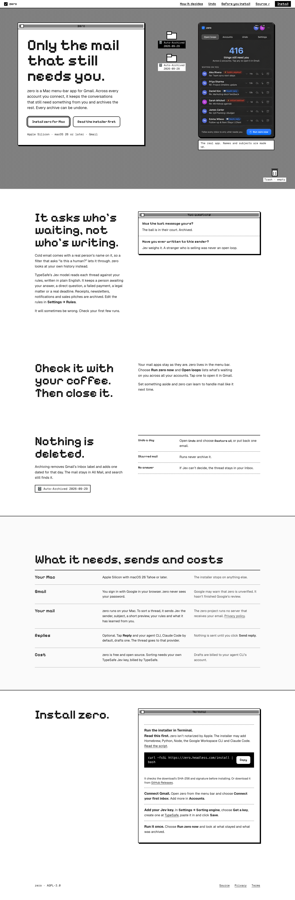
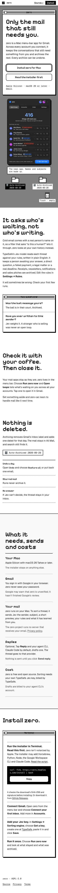
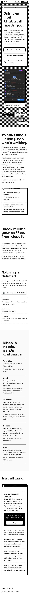
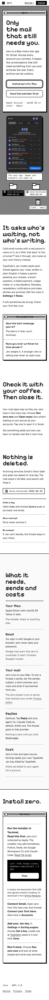

# Slice 03 independent QA proof

**Candidate:** `3f8f1a4e19b2d0eb9cb773d5cacd8c28acfd232e` (source commit `1f8e641`, proof commit `3f8f1a4`)

**Verdict:** **PASS for the authorized content, visual, responsive-browser, and functional QA scope on this exact candidate.** This is not a deployment/release approval. The owner’s approval remains provisional and subject to the stated morning veto. Docker/nginx packaging and `/install` redirect behavior remain an explicit unpassed release gate.

No landing source was changed by QA. The six full-page desktop/mobile captures and machine-readable browser report in this directory were produced from the candidate served from an immutable checkout at the exact SHA above.

## Requirement-mapped results

| Requirement | Check performed | Result |
| --- | --- | --- |
| Owner-authorized message and visitor decision path | Compared rendered headings and section order at all requested viewports and against `02b-content-structure/CONTENT-PROPOSAL.md` and its desktop/mobile compositions | **Pass.** Six sections in order: “Only the mail that still needs you.”, “It asks who’s waiting, not who’s writing.”, “Check it with your coffee. Then close it.”, “Nothing is deleted.”, “What it needs, sends and costs”, “Install zero.” This is materially the requested visitor-first story, not the rejected feature-inventory order. |
| Hero and primary app | Inspected true 1440/390/320 renders and decoded image | **Pass.** One compact requirement line; primary buttons remain prominent; portrait `panel-cut.png` is decoded at 700×1057 and renders without clipping. Its desktop rendered size is about 372×560. At narrow sizes the app panel stacks below the intro, as expected for the approved mobile composition. |
| Judgment and differentiator | DOM/source review plus browser rendering | **Pass.** The two-question window replaces the retired seven-row rules table. No HTML table, FAQ, Canvas, legacy board, animation observer, or former board control is present in shipped landing source. |
| Ambient use and recovery truth | Rendered content and source assertions | **Pass.** The coffee/close narrative is present. Recovery says archived mail remains in All Mail and searchable, dated recovery labels are shown, and Undo/Restore all, starred protection, and uncertain-thread behavior are explained. |
| Factual disclosures | Inspected rendered fact rows and links | **Pass.** Apple Silicon/macOS 26 requirement, Google sign-in and unverified-app caveat, Jev data sent for sorting/no Zero server receiving email, optional reply drafting and provider handoff, no sending without explicit action, TypeSafe/agent billing, and privacy/legal links are present. |
| Install path | DOM assertions and full-page screenshots | **Pass.** Four ordered semantic steps. Terminal command and unnotarized-installer/developer-tools warning are together in step one; command is exactly `curl -fsSL https://zero.headless.com/install | bash`. The alternate GitHub Releases path is present. |
| Responsive layout and clipping | Real Chromium and WebKit viewport contexts at 1440×900, 390×844, and 320×700; DOM geometry/offender checks and visual review | **Pass.** All six `clientWidth` and `scrollWidth` values equal the viewport width (1440, 390, 320 respectively); no geometry offenders, bad text, or browser page errors were reported. Full-page screenshots are included below. |
| Reduced motion and authored folder moment | Emulated `prefers-reduced-motion` in each engine; checked computed styles/active animations. Also checked normal-motion folder animation after settlement. | **Pass.** Under reduced motion the animation is `none`, duration/delay are 0, no animations run, and the element is fully visible in its resting state. Without reduction, the CSS-only `folder-drop` settles at full opacity and identity transform. No Canvas/legacy motion implementation was restored. |
| No-JavaScript resilience | Disabled JavaScript in Chromium and WebKit at 390px and inspected document | **Pass.** All six sections, all four install steps, exact command, and app image remain available; the nonfunctional Copy button is hidden. |
| Copy keyboard success and denial | Keyboard Enter activation of Copy in Chromium and WebKit; instrumented clipboard adapter for success and rejection cases | **Pass for UI behavior.** In both outcomes, focus stayed on `#copy-command`; success status and denial/manual-copy status were announced, and success payload matched the exact command. **Boundary:** browser automation’s system clipboard permission was unavailable here; these checks used an instrumented adapter rather than asserting an OS clipboard write. The implementation’s real Aside success-path check is also recorded in the builder proof. |
| Semantics and visible keyboard focus | DOM landmarks/heading assertions and keyboard interaction | **Pass for inspected semantics.** One `main`, one `h1`, named primary/footer navigation, skip link, and visible focus outline were observed. Chromium keyboard navigation reaches the skip link first and activation targets `#main`. In the WebKit automation context the first Tab skipped the link and landed on Copy; this may reflect platform full-keyboard-access defaults, so it is recorded rather than generalized as a VoiceOver/system accessibility certification. No screen-reader/VoiceOver session or automated axe audit was run. |
| Public route/assets smoke | Python static server and HTTP checks for homepage, legal pages, CSS/JS, fonts, app images, robots, sitemap, and llms file; unknown routes probed | **Partial pass.** Public static resources checked returned 200 and `/nope` returned 404. Python’s static server returns 404 for `/install` and `/install.sh`, as expected because it does not implement nginx redirects. This does not establish production route behavior. |
| Build/package boundary | `bash landing/build.sh` and inspection of `landing/nginx.conf` | **Blocked, not passed.** Installer syntax check passed, then the build’s Docker smoke failed because the local Docker daemon is unavailable (`Cannot connect to ... docker.sock`). Consequently Docker image behavior and nginx `/install` and `/install.sh` 302 redirects were not verified. Run the documented Docker/nginx smoke before release. |
| Performance/source inventory | Source, asset and dependency-path review; image decode; browser console/page errors | **No blocking source issue observed.** Retired implementation hooks are absent and browser errors were empty. A formal performance/Lighthouse measurement was not run, so no performance score or budget is claimed. |

## Browser matrix

| Engine | Viewport | `clientWidth / scrollWidth` | Geometry offenders | Page errors |
| --- | ---: | ---: | ---: | ---: |
| Chromium | 1440×900 | 1440 / 1440 | 0 | 0 |
| Chromium | 390×844 | 390 / 390 | 0 | 0 |
| Chromium | 320×700 | 320 / 320 | 0 | 0 |
| WebKit | 1440×900 | 1440 / 1440 | 0 | 0 |
| WebKit | 390×844 | 390 / 390 | 0 | 0 |
| WebKit | 320×700 | 320 / 320 | 0 | 0 |

## Visual evidence

These are actual browser viewport captures, not iframe-width simulations.

### Chromium

- 1440 desktop: 
- 390 mobile: 
- 320 narrow mobile: 

### WebKit

- 1440 desktop: 
- 390 mobile: 
- 320 narrow mobile: 

Machine-readable DOM/viewport/behavior evidence: [`browser-report.json`](browser-report.json).

## Reproduction checks

On the exact candidate checkout, these checks passed:

```text
node --test landing/test-site.mjs                         6/6 passed
node --check landing/site.js                              passed
bash -n landing/build.sh landing/deploy.sh macapp/install-zero.sh  passed
```

`git diff --check -- landing` passed on the candidate source change. QA added proof/screenshots only; it did not modify `landing/`.

## Final boundary

No deployment, push, or release was attempted or requested. This QA verdict covers the reviewed candidate and listed browser paths only. It is not an owner sign-off, a Docker/nginx pass, a production route verification, or a formal screen-reader/performance certification.
