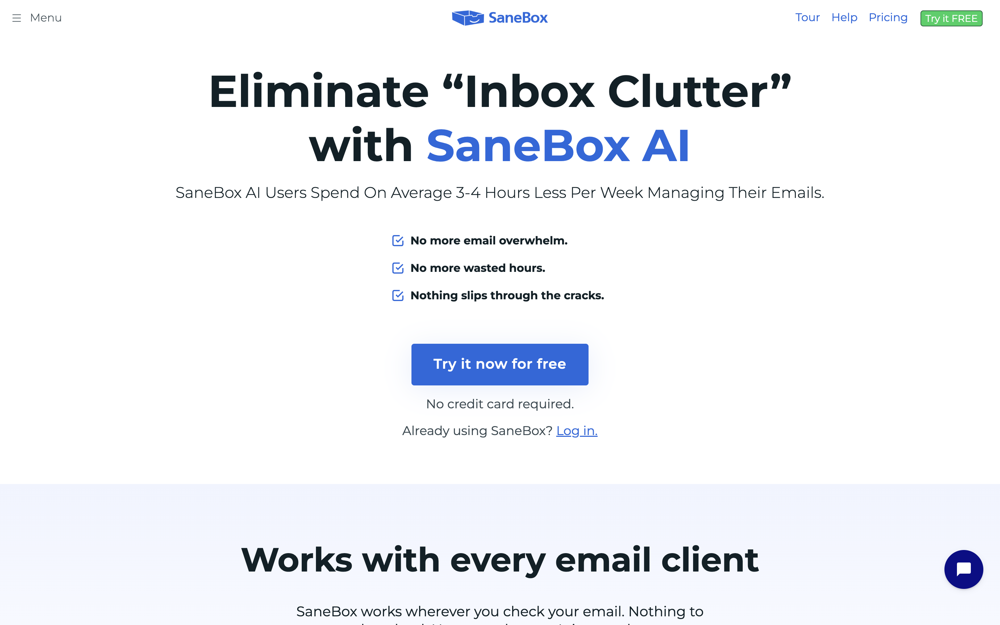
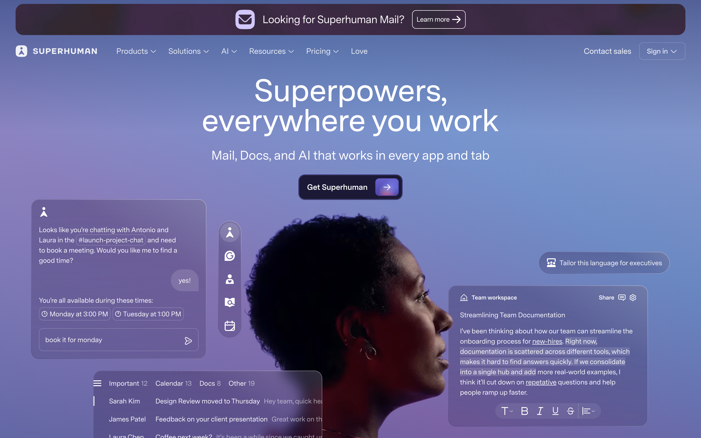
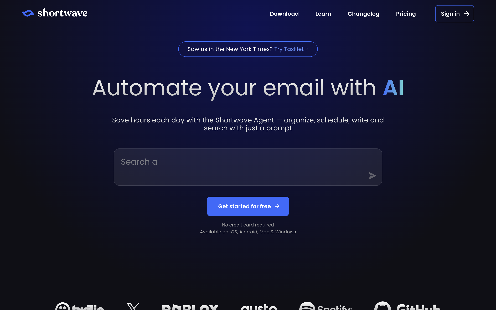
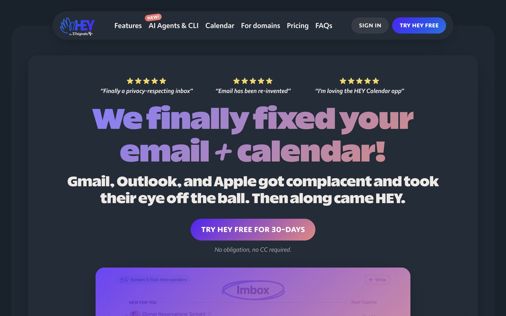
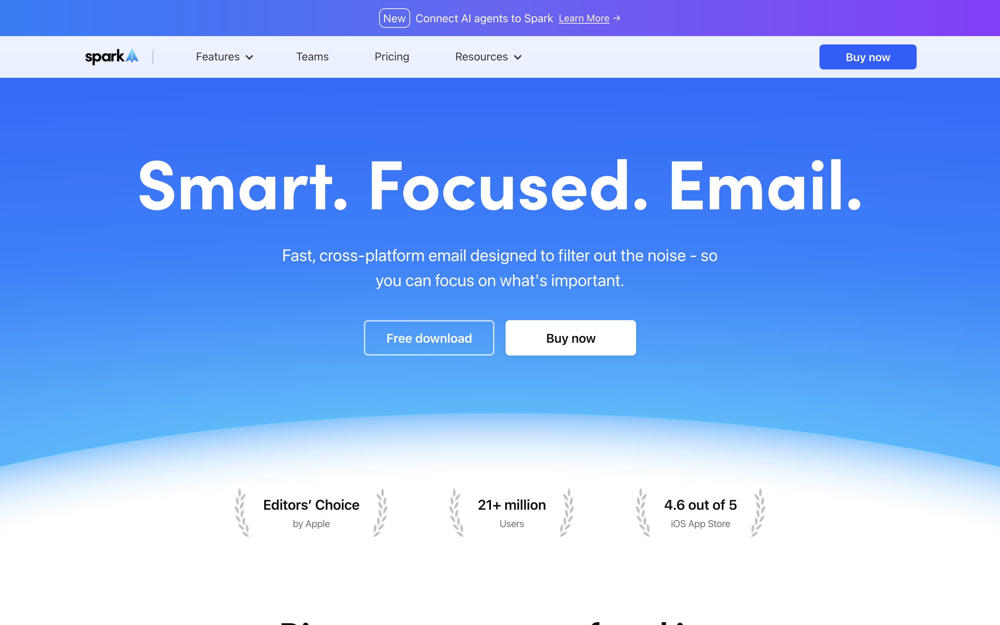
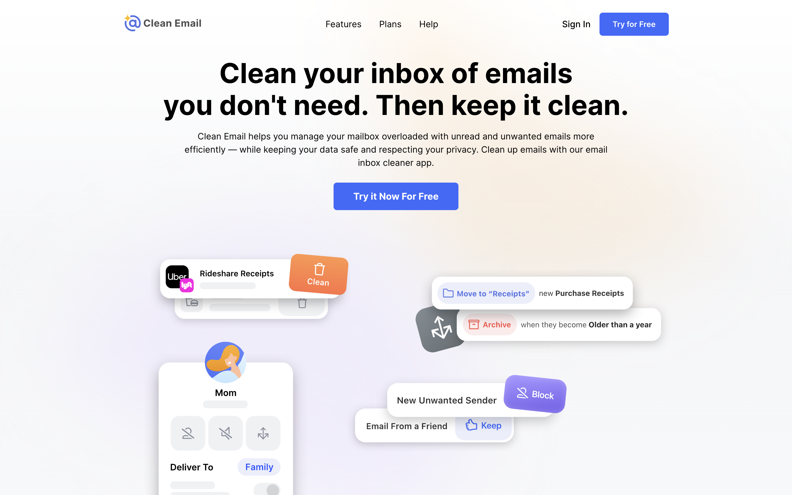

Authoring clearance only. Candidate a4b29a974d98d1b3b52f91496e70951b1508c293 contains COPY v3, OUTLINE v2 and the complete slice 01 proof package. See ../PROOF.md for requirement-to-evidence mapping and HANDOFF.md for the next action. The measured inventory is not built-page QA. Earlier invalid reader rounds remain recorded. Owner gate A and main-lead presentation with gate B remain pending. No implementation authorization, landing edits, push, deploy or inbox mutation. Designer and builder must recount all repeated or added visual chrome, since the candidate has only one spare word.

## Media

