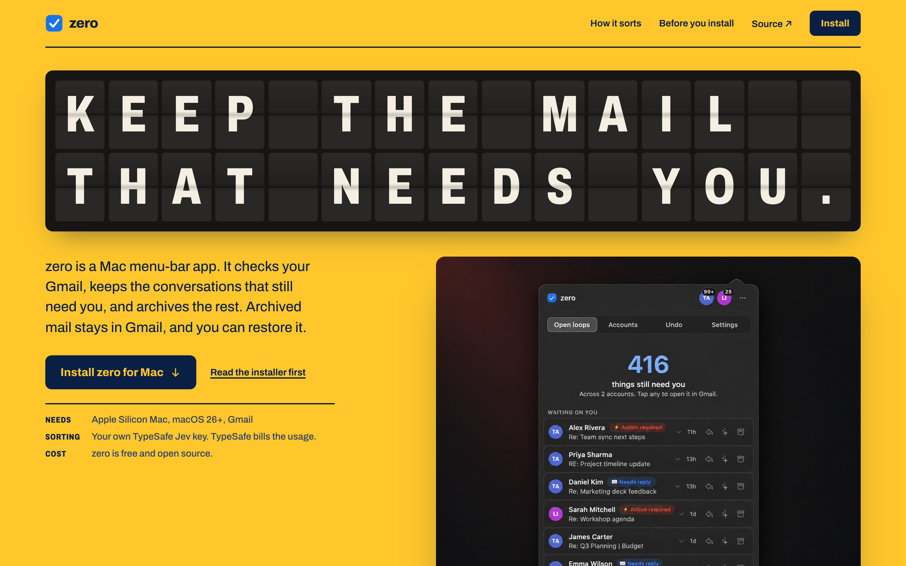
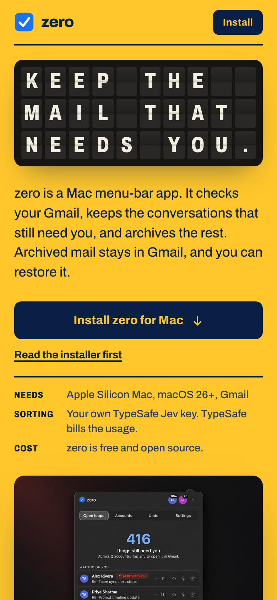
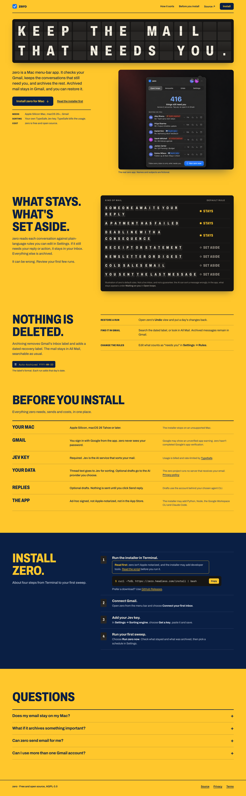



Design-lead self-check of the direction deliverable. Items 1 and 2 are covered by DESIGN-BRIEF.md, refs/ and the mockup captures. Item 3 (mission owner acknowledgement) is outstanding.

## Media

