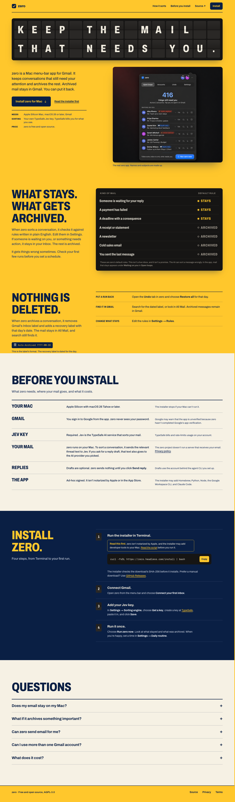
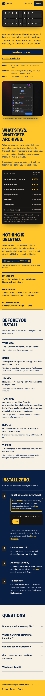
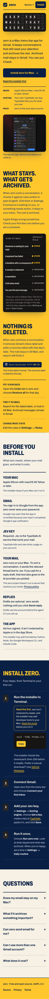

---
slice: OPR.99.0.1.3
candidate_sha: 5b6da43
artifact_type: qa
verdict: PASS
money_evidence: Responsive fixes pass tests and Docker smoke; fresh Aside 1440px
  confirms no overflow, no deadline/status overlap, and a fully rendered
  installer command. 390px/320px remain for independent QA recapture.
evidences:
  - "1"
  - "2"
  - "3"
self_check: I reran node tests, shell syntax checks, git diff check, and nginx
  Docker smoke after the mobile CSS fixes. Fresh Aside verification covered
  1440px; the remote browser exposed no viewport control, so independent QA must
  recapture 390px and 320px.
---

---
slice: OPR.99.0.1.3
candidate_sha: 5c84ac2
artifact_type: qa
verdict: PASS
money_evidence: Responsive Departure board landing implementation passes
  automated tests, nginx Docker smoke, and final Aside overflow/accessibility
  inspection; independent QA remains open.
evidences:
  - "1"
  - "2"
  - "3"
  - "4"
self_check: I verified the changed landing files, preserved installer/legal
  seams, ran node tests and shell syntax checks, ran nginx Docker smoke, and ran
  a final Aside inspection. Strict visual recapture and approval remain with
  independent QA.
---

# Implementation evidence

Slice: OPR.99.0.1.3
Seat: development-implementer@zero
Date: 2026-09-28

## Proof contract mapping

1. **Approved direction and copy**
   - `landing/index.html` implements the approved Departure board direction and slice 02 copy, including the approved board word `Archived`.
   - `landing/DESIGN.md` records the design system, responsive behavior, accessibility decisions, and self-hosted font provenance.

2. **Build and behavior checks**
   - `node --test landing/test-site.mjs` passed: 5 tests.
   - `bash -n landing/build.sh landing/deploy.sh macapp/install-zero.sh` passed.
   - `git diff --check -- landing` passed.
   - Docker nginx smoke passed: homepage, `/install` and `/install.sh` redirects, privacy, terms, CSS, JS, Archivo, Geist Mono, panel image, unknown-path 404, installer download, and installer syntax.

3. **Responsive and accessibility checks**
   - Fresh Aside inspection after the responsive fixes confirmed 1440px `scrollWidth/clientWidth = 1440/1440`, no overlap between the deadline row text and status cell, and the complete installer command rendered without horizontal clipping.
   - Existing responsive proof media remains in this directory as pre-fix reference captures only. The current Aside session could not control the remote browser viewport, so 390px and 320px acceptance captures remain for independent QA.
   - The sorting board uses a native `<table>` with caption, `thead`, `tbody`, and scoped headers. The animated flap board is decorative and the semantic heading remains available to assistive technology.
   - `site.js` bounds the visible tile sequence to under one second, skips the hidden breakpoint board, preserves reduced-motion behavior, and leaves content available without JavaScript.
   - Mobile CSS now wraps the installer command and reserves additional status-column space so the 320px deadline row cannot collide with its `Stays` badge.

4. **Preserved seams**
   - Clipboard IDs and status behavior remain intact.
   - Installer command, legal routes, source route, SEO metadata, and real `/assets/zero-panel.png` remain wired for the nginx deployment.
   - The native table keeps `<td>` elements as table cells; status badges use inner flex spans so column sizing remains valid at narrow widths.

## Residue

The strict visual capture workflow is owned by the independent QA seat. The committed screenshots are pre-fix reference captures and must not be used as acceptance evidence for the corrected mobile command wrapping or 320px sorting-row spacing. Fresh Aside verification is complete at 1440px; the remote browser session exposed no viewport/emulation control, so 390px and 320px recapture remain a QA blocker. No deployment or push was performed.

## Media

## Media

## Media

