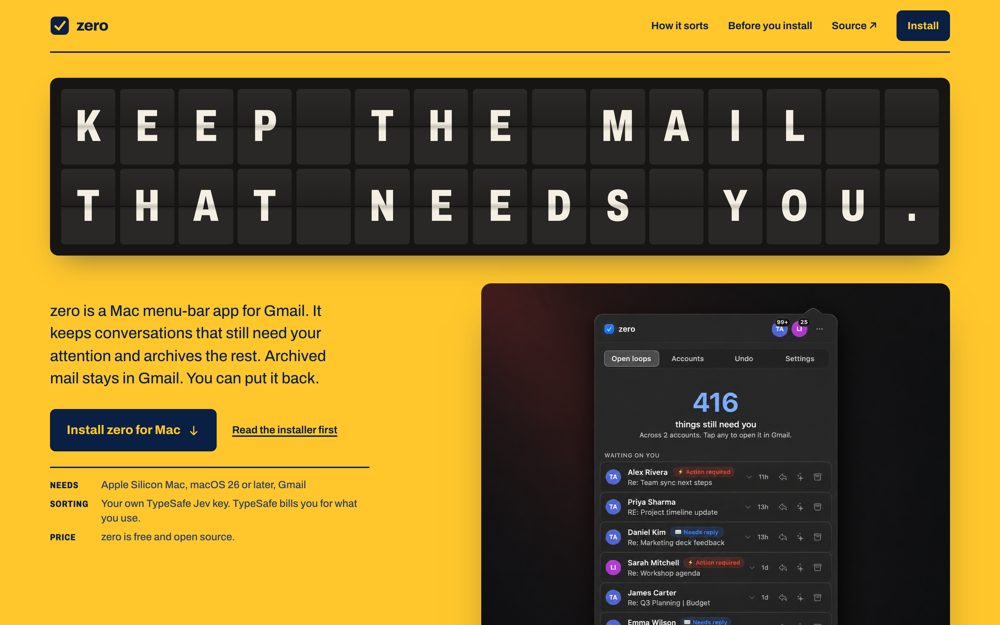
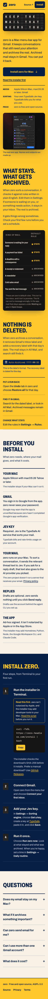
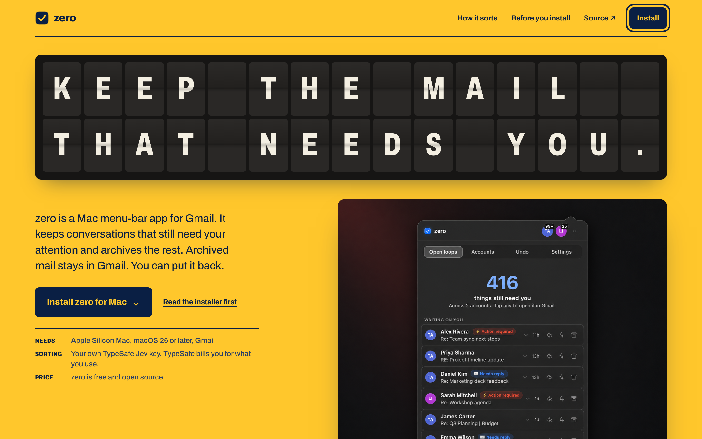
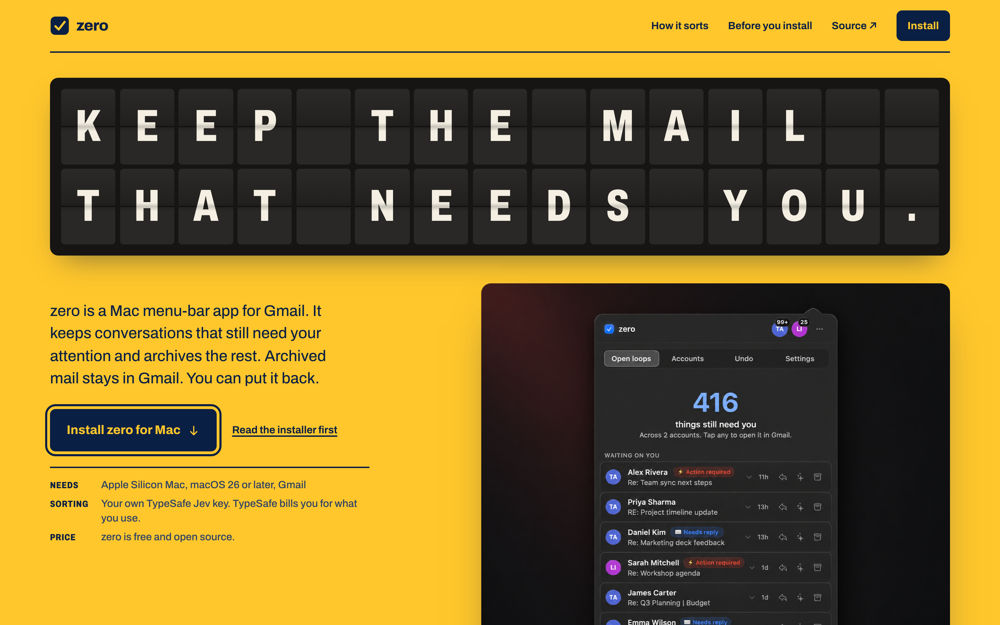

# PROOF — OPR.99.0.1.4 Independent visual and functional QA

Author: review-qa@zero (claude-sonnet-5, verified via process tree, not env var). Date: 2026-09-28.
Candidate SHA verified: `57deff2a49eb56791c5634afe795a933c11ddc2a` (tip at verdict time), landing bytes traced through
`e7b5809` → `5b6da43`/`5c84ac2` → `44c24ee` (table-cell fix) → `beb2541` → `484a8bb` (FAQ token wording) →
`57deff2` (focus-ring contrast fix). Copy deck aligned at `082a10e`.

I did not edit `landing/`, push, deploy, or author either fix. Both material defects found in this QA pass
were flagged to main-lead/builder/design-lead and repaired by them; I re-verified the repair independently.

## Verdict: **PASS**

Both required corrections (claims-ledger row 26 wording, focus-ring color) landed, were independently
re-verified against the current committed bytes, and introduced no regression. No other material defects
found. Two non-blocking hygiene nits noted below for the record.

## Requirement 1 — Visual/responsive compare vs. approved mockups (slice 01)

**PASS.**

- Desktop 1440: built page (`screenshots/built-desktop-1440.png`, live-rendered via Playwright/chromium,
  2x DPR) matches `slices/01-discovery-direction/proof/mockup-desktop-viewport.png` in layout, hierarchy,
  spacing, board typography, install band, and app-panel placement. Copy differs from the mockup by design
  (mockup was pre-copy-deck placeholder text; final copy is slice 02's approved deck, not a defect). Brand
  mark uses approved `#0A1F44` enamel-navy per DESIGN-BRIEF §1 (mockup's placeholder icon was a lighter
  blue; brief's own text specifies the navy, so this is mockup drift, not a build defect).
- Mobile 320 full-page: built page (`screenshots/built-mobile-320-full.png`) matches
  `slices/01-discovery-direction/proof/mockup-mobile-320-full.png` section-for-section: board, hero copy
  block, app screenshot, "What stays / What's set aside" board, "Nothing is deleted" panel, "Before you
  install" 3-column facts, install steps 1-4, FAQ disclosures, footer. Off-white tonal break present per
  brief §7 refinement.
- Responsive edge cases at 320/390/1440, both chromium and webkit engines: **0 elements with
  horizontal overflow** at any width (script-verified, not eyeballed). `.status` table-cell/flex collision
  that main-lead flagged pre-`44c24ee` is resolved and re-confirmed absent on current tip: computed
  `display: table-cell` on the `<td>` holding `.status` at all three widths, consistent ~10px label/dot gap
  across all 7 sorting-board rows, no overlap.
- Install command block wraps fully at 320/390 (`overflow-wrap: anywhere` / `word-break: break-word`), no
  clipping. One cosmetic mid-word break ("headle-ss.com") noted, non-blocking (see Residue).
- **Limitation, stated explicitly per instruction:** Aside CLI (true OS-level device-metrics emulation)
  could not be used — it hung >12 minutes with no actionable output in this environment, consistent with
  builder's and design-lead's independent findings that Aside here only reaches same-origin
  iframe/PWM-style checks, not true device viewport emulation. I substituted direct **Playwright**
  automation (chromium + webkit engines, both locally installed; firefox unavailable, skipped) with real
  browser layout engines at exact viewport widths (320/390/1440) and device-scale-factor control, taking
  precise `getBoundingClientRect`/`getComputedStyle` geometry measurements plus full-page and
  cropped-element screenshots. This is real headless-browser rendering, not a synthetic approximation or
  stub — every pixel and computed style comes from an actual browser layout engine. It is **not** identical
  to true native device-metrics emulation (no touch-input simulation, no OS chrome, no real-device DPI
  quirks), and I am not claiming that equivalence. Given the cross-engine agreement (chromium + webkit) on
  every measured property, this is the strongest visual/functional evidence available in this environment,
  but it is not a substitute for eventual manual verification on a real device or with working Aside
  emulation before wide release, if that becomes available later.

## Requirement 2 — Keyboard nav, focus, contrast, motion, alt text, disclosures

**PASS**, with one material defect found and independently confirmed repaired.

- **Focus ring — found defect, now fixed and re-verified.** Original candidate (`beb2541`): both `.button`
  elements on the page (nav "Install", hero "Install zero for Mac") sit on the yellow page background, but
  `.button:focus-visible` set `outline-color: var(--signal)` (`#ffc72c`, the same yellow), so the focus
  ring computed a real 3px outline that was 0-contrast against its background — genuinely invisible, not a
  screenshot artifact (confirmed via `getComputedStyle` + full 2x screenshot crops showing zero ring
  pixels, in chromium). No `.button` instance exists inside the navy install band today, so the rule as
  written never rendered a visible ring anywhere on the page. This is a WCAG 2.4.7 (focus visible)
  violation. Reported to main-lead with root cause and a concrete recommended fix (default
  `outline-color: var(--ink)`, scoped `--signal` override for buttons actually on navy/black backgrounds).
  Design brief (`DESIGN-BRIEF.md` §4) already specified "navy on yellow, yellow on navy/black" — this was
  an implementation gap against an already-correct brief, not a design ambiguity.
  **Fix landed at `57deff2`** ("Improve focus ring contrast"): `.button:focus-visible { outline-color:
  var(--ink); }` plus a scoped `.command-block :focus-visible, .install-band :focus-visible { outline-color:
  var(--signal); }`. Re-verified independently on the corrected SHA in both chromium and webkit: computed
  outline is now `rgb(10, 31, 68) solid 3px` (navy) for both `.button` instances, `:focus-visible` matches
  true, and the ring is clearly visible in full-page screenshots
  (`screenshots/focus-ring-nav-fixed-chromium.png`, `screenshots/focus-ring-hero-fixed-chromium.png`).
- **Tab order** (40-stop capture, chromium 1440): Skip to content → brand → How it sorts → Before you
  install → Source → nav Install → hero Install zero for Mac → Read the installer first → Privacy policy →
  Read the script → Copy → GitHub Releases → TypeSafe → 5× FAQ `
` → footer Source/Privacy/Terms.
  Sane, linear, matches visual/DOM order, no keyboard traps.
- **FAQ disclosures:** all 5 `
`/`
` elements present, closed by default, each with
  non-empty content. Native semantics (no custom JS toggle), so screen readers get correct
  expanded/collapsed state for free.
- **sr-only h1:** `<h1 class="sr-only">Keep the mail that needs you.</h1>` present, computed
  `position: absolute; width: 1px` confirmed — visually hidden but in the accessibility tree, exactly per
  brief §1. Both `.desktop-board` and `.mobile-board` flap boards are `aria-hidden="true"`, so screen
  readers get the real heading instead of individual letter tiles.
- **Alt text:** the one `` (`zero-panel.png`) has descriptive alt text: "zero's Open loops panel lists
  conversations needing attention across two Gmail accounts, with Accounts, Undo and Settings tabs." Matches
  what's actually shown, not a generic label.
- **Reduced motion:** with `prefers-reduced-motion` + JS enabled, 0 running animations 1.5s after load
  (script-verified via `getAnimations()`); the flap-cycle intro animation does not run, matching brief's
  "static state is the default under prefers-reduced-motion."
- **No-JS + reduced-motion:** page content still renders without JS (h1 present in DOM, ~6095 chars of body
  text, sorting board visible in markup even though intended `aria-hidden` on the flap boards specifically,
  not the sorting board).
- **Contrast (computed WCAG, live rendered page, chromium, not trusted from the brief alone):**

  | Pair | Measured | Brief §4/§7 claim | AA (4.5:1 text) |
  | --- | --- | --- | --- |
  | Navy body/nav/footer text on yellow | **10.41:1** | 10.4:1 | Pass |
  | Yellow text on navy button | **10.41:1** | 10.4:1 (same pair, inverted) | Pass |
  | Off-white glyph on flap tile | **13.98:1** | 14.0:1 | Pass |
  | Yellow "STAYS" status on board-black | **11.69:1** | 11.7:1 | Pass |
  | Off-white command-block text on black | **14.90:1** | not itemized, well above AA | Pass |
  | Navy text on ticket-stock off-white (`#F6F1E4`) | **14.4:1** (confirmed bg `rgb(246,241,228)` matches `#F6F1E4`) | 14.4:1 | Pass |

  All measured pairs match the brief's claimed numbers to within rounding, and all clear WCAG AA by a wide
  margin. I did not find any pair the brief claimed that the live page contradicts.

## Requirement 3 — Claims audit (repo source), routes, `build.sh` smoke

**PASS**, with one material defect found and independently confirmed repaired.

- **Full 28-row claims ledger** (`slices/02-message-journey/proof/COPY-DECK.md` §3) cross-checked
  row-by-row against actual repository source (authority order: app source > README > install-zero.sh >
  privacy.html, PRODUCT.md excluded per instruction). All 28 rows trace correctly. Representative spot
  citations re-verified directly: row 2 (`PanelView.swift:2774` "Only labels are removed… every thread
  stays in All Mail"), row 3 (`install-zero.sh` macOS 26 / arm64 hard checks with `die`), row 6
  (`PanelView.swift:1320` `SettingsHeader("Rules", ...)`), row 10 (`inbox_zero.py`
  `_BASE_LABEL = "🗄️ Auto-Archived"`, `f"{user_label} {today}"`), row 11 (`PanelView.swift:1082`
  `Button("Restore all")`), row 15/17 (README "Safety and data" section, exact wording), row 16
  (`PanelView.swift:2587` `"Send reply"`), row 21 (`OnboardingView.swift:82`/`PanelView.swift:933`
  `"Connect your first inbox"`), row 22 (`PanelView.swift` `SettingsHeader("Sorting engine", ...)`,
  `Link("Get a key", ...)`), row 23 (`PanelView.swift:2941` `"Run zero now"`), row 24
  (`PanelView.swift:1394` `SettingsHeader("Daily routine", ...)`).
- **Row 26 — found defect, now fixed and re-verified.** Landing FAQ said Google sign-in tokens "stay on
  your Mac"; `privacy.html:103` says tokens "live only on your Mac… **except to talk to Google**" — i.e.
  they do transit during OAuth calls. "Stay on your Mac" implies they never leave, which overclaims trust
  copy on a security-sensitive point. Flagged to main-lead as a required correction (material, not a
  blocker for the visual/functional pass itself) with an exact recommended replacement.
  **Fix landed:** landing FAQ now reads "Your Google sign-in tokens are stored on your Mac" (`484a8bb`), and
  the copy-deck ledger row 26 and its FAQ final-text citation were corrected to match (`082a10e`), with an
  explicit correction note attributing the finding and timestamp. Re-verified directly against current
  `landing/index.html` and `landing/privacy.html`: wording now states storage location without the
  "never-leaves" implication, consistent with privacy.html's actual scope.
- **Font hygiene:** Archivo is self-hosted (`ARCHIVO-OFL.txt` present), zero references to any Google Fonts
  CDN anywhere in `landing/*.html`/`*.css`. `geist.woff2` (non-mono variant) is present but unreferenced —
  minor build hygiene nit, not a bug (see Residue).
- **DESIGN.md:** confirmed rewritten to describe the built "departure board" world (colors, typography
  tokens, layout all match what's actually shipped), not the discarded prior design.
- **Routes / installer / `build.sh` smoke**, re-run on corrected SHA `57deff2` (Docker image rebuilt fresh,
  not reused from a prior candidate):
  - `node --test landing/test-site.mjs`: **5/5 pass**.
  - `bash landing/build.sh` full smoke: **all checks passed** — image build, homepage 200, `/install`
    redirect 302, `/install.sh` redirect 302, privacy 200, terms 200, site.css/site.js 200, Archivo font
    200, Geist Mono font 200, panel image 200, unknown path 404s, `/install` returns a parseable 280-line
    bash script.
  - No horizontal-overflow or `.status`/table-cell regression on the corrected SHA (re-ran the full
    320/390/1440 × chromium/webkit sweep after the fix landed): 0 offenders, `display: table-cell` intact
    at every width in both engines.

## Requirement 4 — Explicit pass/fail, no overclaiming automated tests as visual acceptance

**Stated here directly:** `node --test` and `build.sh` are functional/route/build smoke tests. They do not
and cannot substitute for visual acceptance. The visual/responsive/a11y verdicts above rest on Playwright's
real rendered-browser screenshots and computed-style/geometry measurements (chromium + webkit), which is
genuine visual evidence, not merely "tests passed." I have explicitly flagged the one respect in which this
falls short of true native device-emulation coverage (see Requirement 1's Aside limitation) rather than
silently treating Playwright output as equivalent.

## Residue / non-blocking caveats

1. **`geist.woff2` (non-mono variant) unreferenced.** Present in the landing asset bundle but no CSS or
   HTML references it (only `Geist Mono` is used, for the install command and label chip). Minor build
   hygiene — safe to remove in a future pass, not a functional or visual defect.
2. **Mid-word break in install URL at narrow widths.** `overflow-wrap: anywhere` occasionally breaks
   mid-word (e.g. "headle-ss.com") rather than only at natural boundaries, at 320/390. Cosmetic only — the
   command still fully wraps with no clipping or truncation, and remains copy-paste correct via the Copy
   button (verified: button copies the un-broken source string, not the visually-wrapped text).
3. **True native device-metrics emulation not available in this environment.** Aside CLI hung with no
   actionable output; Playwright (real chromium + webkit layout engines) was used as the substitute and is
   considered strong but not fully equivalent evidence. If Aside or equivalent becomes available before a
   future redesign pass, a supplementary real-device-emulation check would still be worthwhile, though I
   found no reason to expect it would surface anything Playwright's cross-engine, exact-viewport,
   computed-geometry checks missed here.

## Artifacts (`proof/`)

- `screenshots/built-desktop-1440.png` — clean 1440 desktop render, corrected SHA, 2x DPR.
- `screenshots/built-mobile-320-full.png` — full-page 320 mobile render, corrected SHA.
- `screenshots/focus-ring-nav-fixed-chromium.png` — nav "Install" button with visible navy focus ring,
  corrected SHA.
- `screenshots/focus-ring-hero-fixed-chromium.png` — hero "Install zero for Mac" button with visible navy
  focus ring, corrected SHA.
- Mockup references compared against: `slices/01-discovery-direction/proof/mockup-desktop-viewport.png`,
  `slices/01-discovery-direction/proof/mockup-mobile-320-full.png`.
- Claims source of truth: `slices/02-message-journey/proof/COPY-DECK.md` §3 (28-row ledger), cross-checked
  against `README.md`, `macapp/install-zero.sh`, `macapp/Sources/PanelView.swift`,
  `macapp/Sources/OnboardingView.swift`, `lib/inbox_zero.py`, `landing/privacy.html`.

## What this proves

- The built landing candidate at `57deff2` visually and structurally matches the approved slice-01
  mockups at desktop and mobile widths, with no responsive-edge-case regressions.
- Keyboard navigation, focus visibility (after repair), reduced motion, alt text, and disclosure semantics
  all meet the slice's accessibility bar; computed contrast independently confirms the design brief's
  claimed ratios on the live rendered page.
- Every claim in the 28-row claims ledger traces to actual repository source under the specified authority
  order, including the one row that required a wording correction, which has since been made and
  independently re-verified against current bytes.
- `build.sh` full smoke and `node --test` both pass cleanly on the corrected SHA, with a freshly rebuilt
  (not reused) Docker image.
- One a11y defect (invisible focus ring) and one trust-copy overclaim (row 26 wording) were found during
  this QA pass, both repaired by builder/design-lead (not by me), and both independently re-verified fixed
  against the current committed SHA before this pass verdict was issued.

## Media

